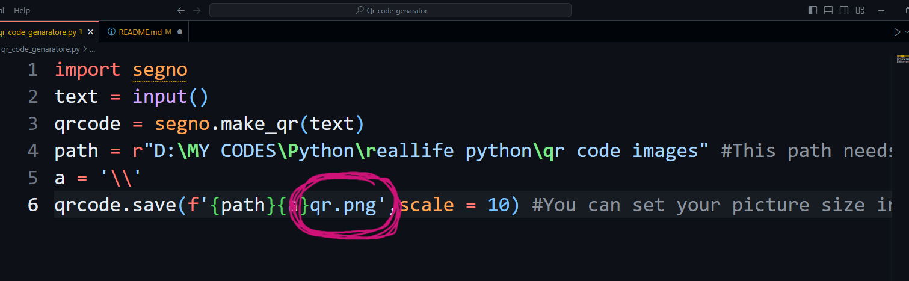
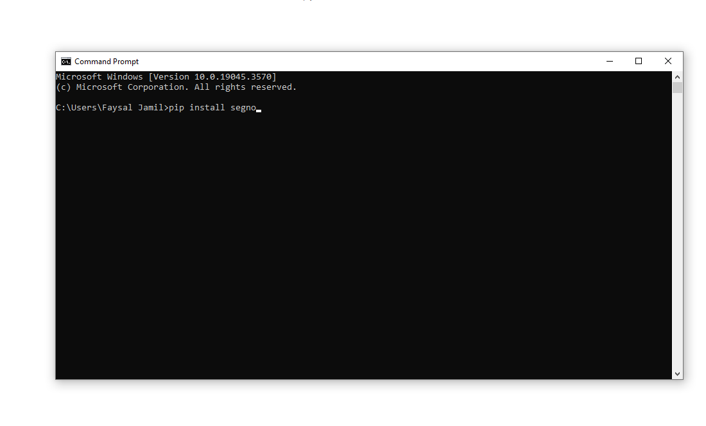
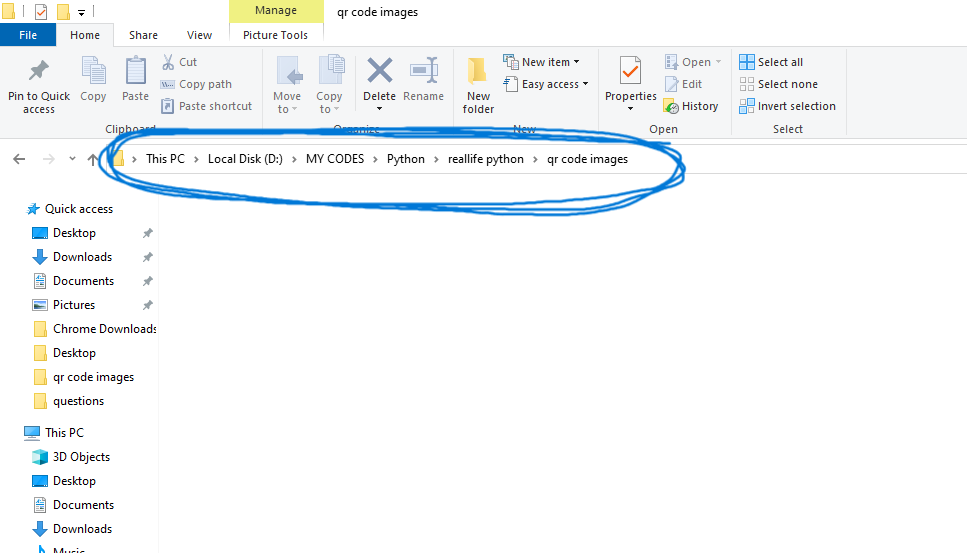

Disclaimer : You can only see the image in your folder when the folder is empty 
or if you want to save multiple images please change the file name as showen bellow:




If you are having errors make sure to follow the the steps below:

To Run This programe you need to have segno library in your system.
if you don't have segno please go to your comand prompt and type the following comand:

```
pip intall segno
```



Then You need to set path for your QR image to be save in your desired folder



